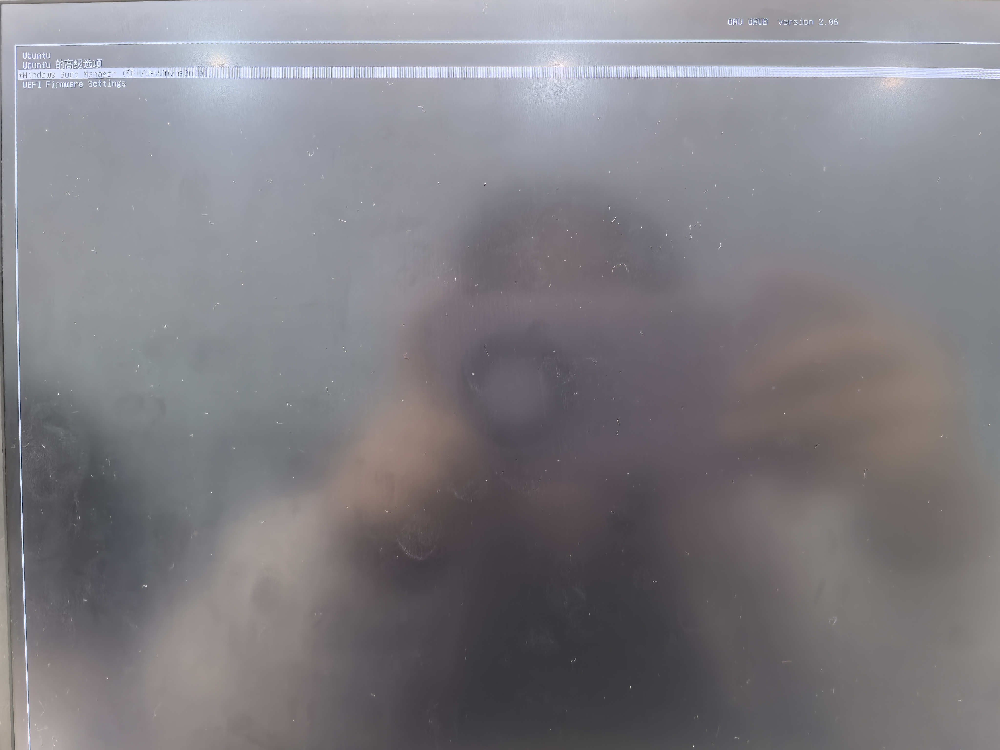

# Week1 实验报告
## 一.实验任务
### 1.**安装双系统**
- Win11+Ubuntu20.04
### 2.**VSCode 安装与配置**
- C++插件安装
- 运行Hello World
### 3.**Git学习与作业上传**
- Git命令学习
- 提交作业至Github对应仓库
### 4.**编写Markdown实验报告**
## 二.实现过程
### 1.**安装双系统**
#### **制作ubuntu系统安装盘**
#### 1）**下载ubuntu镜像文件**
- 官网下载 
#### 2）**制作ubuntu启动盘**
- 使用win32diskImager，映像文件选择ubuntu-20.04.6-desktop-amd64.iso，写入后U盘进行格式化，写入过程结束后点击U盘进入，看到efi文件则启动盘制作完成
### **问题：U盘在写入时无法进行格式化**
- 下载Rufus，设备选择目标U盘，映像文件选择ubuntu-20.04.6-desktop-amd64.iso
- 查看电脑磁盘分区为GPT，目标系统类型选择"UEFI",其他保持默认选择，点击"开始",等待制作完成


#### **安装ubuntu系统**
1）查看电脑磁盘分区类型（我的为GPT），进入"磁盘管理"，选中系统盘D盘，右键"压缩卷"，设置压缩空间量40GB，生成未分配空间

2）借助ubuntu启动盘安装ubuntu系统
##### BIOS设置
- 将制作好的ubuntu启动盘插入想要安装双系统的电脑中，重启电脑，按F2进入启动项选择，进入BIOS界面，将安全启动关闭，U盘设为第一顺位，按F10保存并退出

##### ubuntu系统安装
按F12进入启动设备页面，选择启动盘对应的选项，进入到Ubuntu安装程序中


- 从 U 盘启动后，选择"Install Ubuntu"，语言切换为"中文（简体）"，点击"继续";
- 取消"下载更新"和"安装第三方软件"（后续手动配置），点击"继续";
- 安装类型选择"其他选项"，手动创建分区：
- 选中未分配空间，点击"+"，创建 EFI 分区：大小 500MB，类型"EFI 系统分区";
- 点击"+"，创建 SWAP 分区：大小 10000MB，类型"交换空间"（用于内存扩展）;
- 点击"+"，创建根分区：大小20000MB，类型"Ext4 日志文件系统"，挂载点"/";
- 最后点击"+"，将剩余空间分给挂载点"/home";
- 选择 EFI 分区作为"安装启动器的设备"，点击"安装";
- 依次设置时区（选择中国城市）、键盘布局（默认英语）、用户名和密码，等待安装完成后重启电脑。


##### 双系统切换验证
- 重启后自动进入 GRUB 启动菜单，可选择“Ubuntu 20.04 LTS”或“Windows Boot Manager”，分别启动两个系统，确认均可正常运行。

##### 系统时间同步
打开终端
- 安装时间同步工具
```shell
sudo apt install ntpdate
```
- 使用该工具通过互联网同步时间
```shell
sudo ntpdate time.windows.com
```
- 将时间机制从UTC更改为localtime
```shell
sudo hwclock --localtime --systohc
```
- 修改好后重启计算机，此时可以看到ubuntu系统和windows系统中的时间一致
##### 启动菜单的默认项
```shell
sudo apt install gedit
gedit /etc/default/grub
```
- 在GRUB_DEFAULT选项中将数字设置为windows启动项对应的序号，保存后退出，重启电脑
### 2.**VSCode 安装与配置**
#### 1）安装包安装
- 官网安装
- 下载后在放置deb包的文件夹直接打开终端，然后输入
```shell
sudo  dpkg  -i code_1.45.1-1589445302_amd64.deb
```
#### 2）指令安装
- 先Ubuntu make，然后通过make 安装VSCODE
```shell
sudo add-apt-repository ppa:ubuntu-desktop/ubuntu-make
sudo apt-get update
sudo apt-get install ubuntu-make
umake ide  visual-studio-code
```
安装成功后输入code即可启动
#### 3）C++插件安装及Hello World运行
- 通过VSCode拓展插件下载所需插件，输入代码


### 3.**Git**
- Gitbash安装
- Git和Github绑定
- Git基本命令
- git init
- git config --global user.name "yourname"
- git config --global user.email "your@email.com"
- git add .
- git commit -m "week1 submit"
- git branch -M main
- git remote add origin https://github.com/xxx/xxx.git
- git push -u origin main
### 4.**Markdown报告**
- Markdown报告规范
- 标题 #
- 粗体 **...**
- 代码块 code
- 插入图片
- 列表、有序列表
## 三.遇到的问题与解决方法
**1）Windows无法格式化U盘**
- 解决方法：换用Rufus工具制作，启动盘制作成功

**2）同步系统时间时输入代码显示无法定位软件包**
- 解决方法：手动设置Ubuntu当前正确时间并写入硬件时钟，在终端执行：
```shell
sudo date -s "2025-12-04 16:30:00"
sudo hwclock --localtime --systohc"
```
重启计算机，系统时间同步

**3）系统无法识别网络驱动**
- 未解决：先使用有线网卡通过网线连接到手机提供网络，在终端直接下载驱动：
```shell
sudo lspci -nn | grep -i network
sudo apt update && sudo apt install build-essential git dkms
mkdir rtw89
cd rtw89
make
sudo make install
sudo modprobe rtw89pci
```
驱动已下载成功，但无线网卡仍未被识别，下载对应的固件文件：
```shell
sudo mkdir -p /lib/firmware/rtw89
sudo wget -O /lib/firmware/rtw89/rtw8852c_fw.bin https://git.kernel.org/pub/scm/linux/kernel/git/firmware/linux-firmware.git/plain/rtw89/rtw8852c_fw.bin
sudo modprobe -r rtw89pci && sudo modprobe rtw89pci
```
此时，无线网卡依旧无法识别，原因可能为内置网卡硬件与当前系统不兼容

**4）VSCode启动失败**
- 解决方法：安装snap工具后通过此工具进行启动
```shell
sudo snap install code --classic
```
启动成功

**5）VSCode中拓展未正确安装或未启用**
- 解决方法：在C++文件中按F5，选择"C++(GDB/LLDB)"，选择"C/C++-9构建和调试活动文件，运行成功
## 四.总结与心得
- 总结：本次实验全面完成了 Week1 任务要求的双系统安装、开发环境搭建、Git 基础操作与 Markdown 报告编写。通过手动分区实现了 Windows 与 Ubuntu 的稳定共存，换源配置提升了 Ubuntu 软件下载效率，成功搭建了 VSCode + C++ 的开发环境，掌握了 Git 从配置到仓库推送的完整流程，最终按照规范编写了结构化的实验报告。
- 心得：
       
       1. 双系统安装的关键在于分区规划与 BIOS 配置，UEFI 模式和 Secure Boot 关闭是避免启动故障的核心，手动分区时需明确 EFI、SWAP 和根分区的作用与大小要求；

       2. Ubuntu 系统的命令行操作是基础，换源、工具安装等步骤需准确执行终端命令，遇到报错时可通过查看错误信息定位问题（如 404 对应源地址错误）；

       3. Git 与 GitHub 连接的核心是 SSH 密钥认证，公钥复制需完整，私钥权限配置不可忽视，否则会导致认证失败；

       4. Markdown 语法简洁高效，适合技术文档编写，提前熟悉标题、代码块、表格等常用语法，能大幅提升报告编写效率；

       5. 实验过程中遇到的问题多与配置细节相关，通过查阅官方文档、搜索报错信息能快速找到解决方案，培养了独立排查问题的能力，为后续学习和开发奠定了坚实基础


